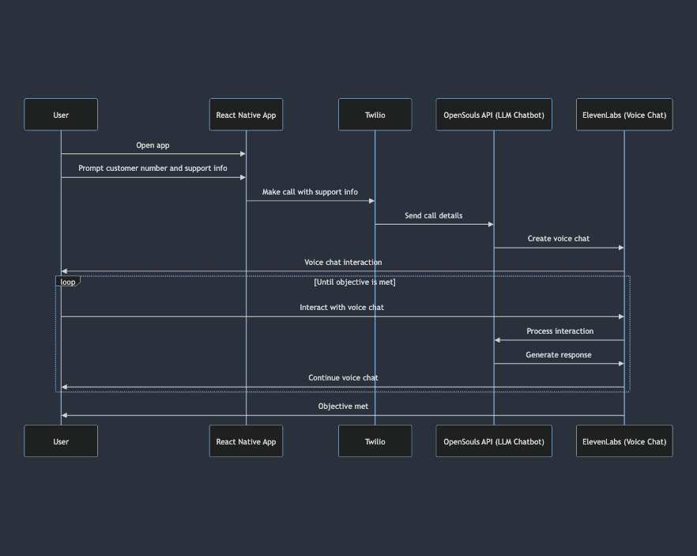

# Cognition-Hackathon
The opensoulcode directory is for sandbox code and setting up the soul.
The call-llm was taken from the eleven public repo and then modified to use the new soul code.

The goal is to link up witn this (repo)[https://github.com/elevenlabs/elevenlabs-examples/blob/main/examples/twilio/call-llm/src/llm.ts]

That will create this flow

